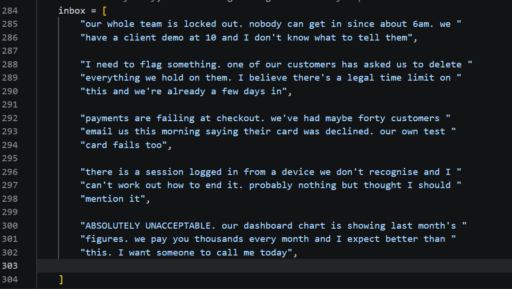
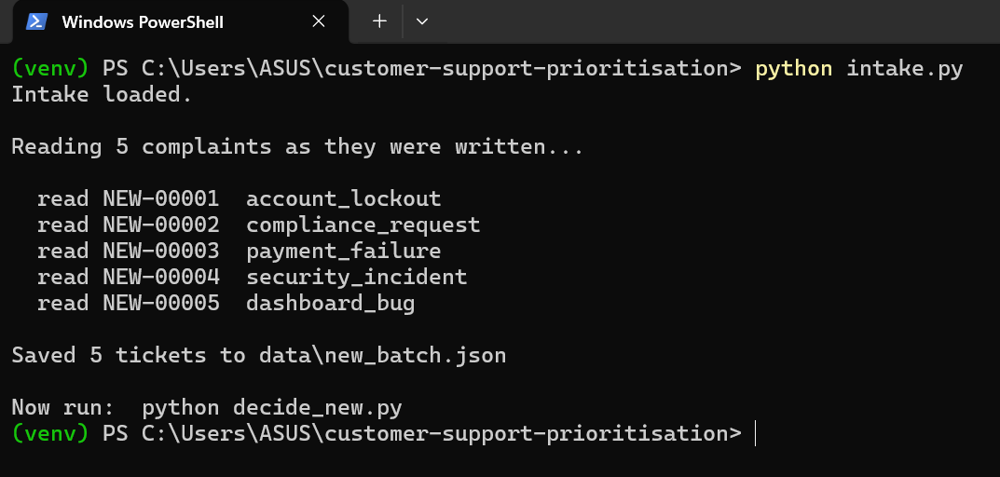
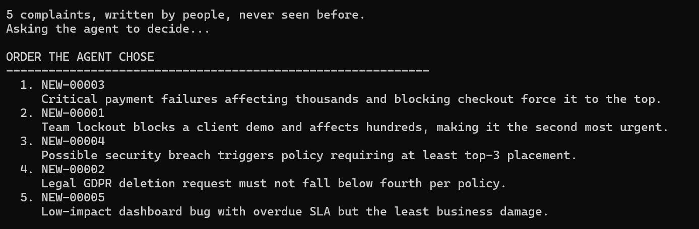
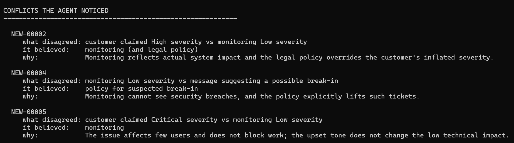
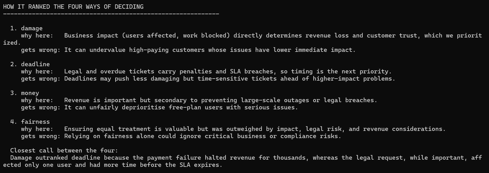
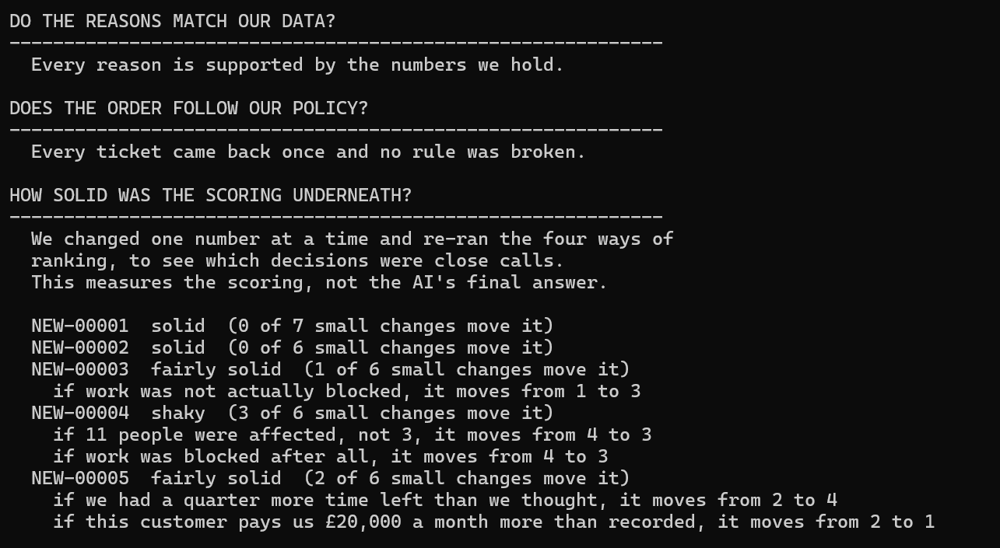
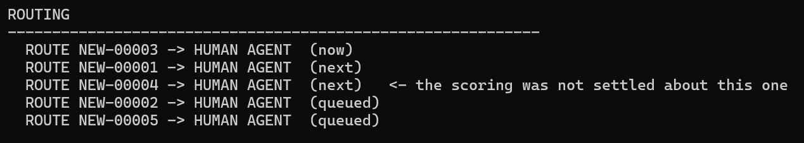

# Ticket Priority Agent

When several customer complaints are waiting at once, this decides which one a
person should deal with first, and explains why it chose that order.

---

## The problem

A support desk gets more complaints than it can answer at once. Somebody has to
decide what gets looked at first.

That sounds easy until you look at two real complaints side by side:

| | Complaint A | Complaint B |
|---|---|---|
| The customer pays us | £39,127 a month | Nothing. They are on the free plan |
| What is wrong | Pages load slowly | Their files have disappeared |
| How many people it affects | 3 | 4,940 |
| We promised to reply within | 2 hours | 72 hours |

Which one comes first?

If you go by money, the paying customer wins and thousands of people wait.
If you go by damage, the free customer wins and your biggest client is annoyed.
If you go by the promise you made, the paying customer wins again.

There is no calculation that settles this. Somebody has to make a judgement and
be able to defend it. That is what this project builds.

---

## The solution

An AI agent that:

1. Looks up three separate systems to find out what is really going on
2. Weighs four different ways of deciding what matters most
3. Reads what the customer actually wrote
4. Commits to one order and explains every position
5. Says out loud what it chose to favour and what that costs
6. Gets checked twice, in case it got something wrong
7. Says how solid each decision was, and flags the close calls for a person
8. Keeps a permanent record of what it did, and writes it up in plain English

---

## The three systems it looks up

Real companies keep customer information in separate places, and each place
only knows part of the story. That is deliberate here, because it is what
creates the disagreement.

| System | What it knows | What it wants | What it cannot see |
|---|---|---|---|
| **Customer records** | Who they are, what plan they pay for | Look after whoever pays most | Whether anything is actually broken |
| **Monitoring** | How many people are affected, whether the system is failing | Fix whatever is most broken | Who the customer is, or what we promised them |
| **The promise clock** | How long we said we would take, how long is left | Answer whatever is closest to breaking a promise | Whether the complaint is important |

None of these three can see what the others see. So they routinely disagree,
and the agent has to work out who to believe.

Each system is a separate file, joined together by the customer's reference
number, the same way separate systems join up in a real company. They were kept
separate on purpose. If everything sat in one big table, the agent would never
have to work out which source to believe, and there would be nothing to reason
about.

### The blind spot, on purpose

Monitoring is deliberately made blind to three kinds of problem: suspected
break-ins, legal requests, and billing errors.

This is not a bug. Picture somebody who has stolen a password and is quietly
reading your files. Nothing is failing. Nobody has reported an error. The
monitoring screen is entirely green.

So the agent is given a case where every automatic warning light says
"nothing to see here" and the right answer is to deal with it immediately. The
only way to spot it is to read what the customer wrote.

---

## How the practice data was made

No real support data was available, so 1,000 past complaints were built from
scratch. This was the largest part of the work, and the choices behind it
matter as much as the agent itself, because a queue where every answer is
obvious would prove nothing.

### Two separate dials for each kind of problem

An early version tied each kind of problem to a fixed list of allowed
seriousness levels. A payment failure could only ever be serious, a password
reset could only ever be minor.

That had to be thrown away. It meant the agent could skip straight from the
kind of problem to the answer, and the three systems became decoration.

The replacement gives every kind of problem two separate dials: how often it
turns up, and how bad it is likely to be when it does.

```python
ISSUE_PROFILES = {
    "system_outage":     {"freq": 1,  "sev": {"High": 0.2, "Critical": 0.8}},
    "security_incident": {"freq": 2,  "sev": {"Medium": 0.2, "High": 0.4, "Critical": 0.4}},
    "payment_failure":   {"freq": 8,  "sev": {"Medium": 0.3, "High": 0.5, "Critical": 0.2}},
    "slow_performance":  {"freq": 15, "sev": {"Low": 0.5, "Medium": 0.35, "High": 0.15}},
    "password_reset":    {"freq": 15, "sev": {"Low": 0.8, "Medium": 0.2}},
}
```

Reading one line: a payment failure turns up eight times as often as a total
outage, and when one appears there is a 30% chance it is medium, 50% high, 20%
critical. Seventeen kinds of problem are covered.

The frequency numbers matter as much as the seriousness ones. Real support
queues are mostly routine, with a thin sliver of emergencies. Password resets
turn up fifteen times as often as total outages, so the practice data looks
like a real inbox rather than a list of disasters.

### Two different opinions on how bad each problem is

Every complaint carries two separate seriousness ratings:

- **What the customer said** when they filled in the form
- **What monitoring worked out** from what it could actually measure

These disagree on 546 out of the 1,000 complaints.

That gap is the point. Customers exaggerate. Somebody who cannot reset their
password ticks "Critical" because to them it is critical. Monitoring sees one
person affected and nothing failing.

How much somebody exaggerates depends on their mood, and their mood depends
partly on how many times they have already written in:

```python
if mood == "angry":
    chance_of_exaggerating = 0.65
elif mood == "annoyed":
    chance_of_exaggerating = 0.35
else:
    chance_of_exaggerating = 0.10
```

So being loud does not mean being urgent, and the agent has to tell those apart
by reading the message rather than trusting the label.

### The true seriousness is thrown away

Each complaint is given a real seriousness when it is created. That is used to
work out what monitoring would have seen, and is then discarded. It is never
saved to any file.

Nobody knows the true answer at the moment a complaint arrives in real life, so
the agent does not get to know it either.

### What happened afterwards is kept in a separate file

A fifth file holds what a person eventually decided, how long it took to fix,
and how it ended. None of that is known when a complaint first arrives.

It is deliberately kept in its own file rather than as extra columns, so the
agent physically cannot read it while deciding. Doing that would be like
marking your own exam with the answers in front of you: the result would look
excellent and mean nothing.

That file is used afterwards, to compare what the agent chose against what a
person actually did.

### Three rounds of fixing data that made no sense

The first version produced combinations no reviewer would believe. Each was
found by printing real examples and reading them, rather than trusting the
summary numbers.

| What was wrong | Why it happened | The fix |
|---|---|---|
| A break-in showing 59 affected people while monitoring called it minor | The seriousness was quietened but the number of affected people was not | Quieten both together, so the story is consistent |
| A request for dark mode coming out as a serious problem | Any kind of problem had a small chance of "blocking work", and blocked work jumps straight to serious | List the problems that never block anyone |
| The deadline warning firing on nearly every large customer | The test asked for "fewer than 2 hours left" but large customers are only promised 2 hours in total, so it could never fail | Compare against a share of what was promised, not a fixed number of hours |

The last one is worth noting. One hour left means something very different for
a 2 hour promise and a 72 hour promise. Comparing raw hours would give you the
opposite of the truth.

---

## Every signal the brief named

The brief lists five things a ticket arrives with. All five reach the agent.

| Signal it names | Where it comes from | How the agent sees it |
|---|---|---|
| Customer account value | `customers.csv` | Plan and monthly value, feeding the revenue strategy |
| Stated urgency in the message | `tickets.csv` | The customer's own words, plus the severity they ticked |
| Historical resolution time for similar issues | Averaged across the 1,000 past complaints | Hours this kind of problem usually takes |
| Current system load | `telemetry.csv` | Load percentage at the moment the complaint arrived |
| Whether the issue blocks a paying workflow | `telemetry.csv` | `work_is_blocked`, worth 150 points in the damage strategy |

### A caution on the history figure

`history_lookup.py` works out the average hours from arrival to resolution for
each kind of problem:

```
data_loss                    5.2 hours on average
system_outage                6.7 hours on average
payment_failure             15.4 hours on average
...
feature_request            118.1 hours on average
billing_error              126.2 hours on average
password_reset             132.4 hours on average
```

Read carelessly that says a password reset is 25 times harder than a data loss.
It says nothing of the sort. A password reset does not need 132 hours of work.
It needs five minutes of work after five days of sitting in a queue.

So this measures **how quickly we chose to act**, not how hard the problem is.
The prompt says so explicitly, otherwise the agent would treat a long history as
evidence of difficulty and keep doing what we have always done. That would make
the agent inherit our worst habits and call it data.

## Where the three systems disagree, and how often

Rather than claiming the systems disagree, the disagreements were counted.
Eight kinds were named, and every one of the 1,000 complaints was tested
against them:

| Kind of disagreement | Count | What it means |
|---|---|---|
| We already broke our promise | 243 | We missed the reply time we agreed |
| Clock running out on something minor | 231 | Barely any time left, but the problem is trivial |
| Pays nothing but badly broken | 143 | Free customer, seriously affected or completely stuck |
| Customer overstating it | 139 | Claimed seriousness is two or more levels above what monitoring sees |
| Asked us again and again | 101 | Has written in seven or more times |
| Monitoring cannot see it | 61 | Break-in, legal request, or billing, where the screen stays green |
| Pays a lot, tiny problem | 46 | Pays £10,000 a month or more, nothing much is wrong |
| Customer understating it | 20 | Monitoring sees it as far worse than the customer said |

One tuning note. The "asked us again and again" test originally used four or
more contacts and fired on 425 out of 1,000. With 1,000 complaints across 200
customers, the average customer writes in five times, so almost everybody
tripped it. A warning that fires on 43% of cases is not a warning. Raising the
bar to seven brought it down to 101.

There is also a case where the labelling is knowingly naive. A legal data
deletion request from a customer paying £17,238 a month got labelled "pays a
lot, tiny problem", because "tiny" in that test means monitoring called it
minor, and monitoring is blind to legal work by design. That was left in rather
than patched. The labelling is simple and the agent has to be less simple than
the labelling.

---

## The six complaints given to the agent

Rather than writing the test cases by hand, a script searches all 1,000 for the
strongest real example of each kind of disagreement.

| Reference | The kind of case | Problem | Plan | Pays | Customer said | Monitoring said |
|---|---|---|---|---|---|---|
| TICK-00707 | Pays a lot, tiny problem | Slow pages | Enterprise | £39,127 | Low | Low |
| TICK-00171 | Free but badly broken | Files gone | Free | £0 | Critical | Critical |
| TICK-00771 | Monitoring cannot see it | Possible break-in | Basic | £55 | High | Low |
| TICK-00266 | Deadline nearly up | Feature request | Enterprise | £29,044 | High | Low |
| TICK-00982 | Asked before | Export broken | Basic | £106 | Medium | Medium |
| TICK-00135 | Overstated | Password reset | Basic | £41 | Critical | Low |

### Why this set is hard

Look at TICK-00135 and TICK-00771 side by side. On the numbers they are almost
identical: one person affected, monitoring says minor, customer claims it is
serious.

One is a password reset and belongs at the bottom. The other is somebody
reporting that their account email was changed without their knowledge, and
belongs near the top.

No amount of counting affected people separates those two. The only thing that
does is reading what the customer wrote. That pair is what stops the agent
taking an easy shortcut like "always believe the customer" or "always believe
monitoring", because both shortcuts fail here.

---

## The four ways of deciding

Each one is reasonable. Each one is wrong on its own.

| Way of deciding | The question it asks | Who it helps | What it gets wrong |
|---|---|---|---|
| **Money** | Who pays us the most? | Big customers | Ignores a total failure for a small customer |
| **Damage** | What is most broken? | Whoever is worst affected | Ignores promises and contracts |
| **Deadline** | What promise breaks first? | Whoever has waited longest | Puts a trivial request above a break-in |
| **Fairness** | Who have we treated worst? | People we keep letting down | Slow to react to a real emergency |

The agent runs all four, then decides for itself. Its order is not a copy of
any one of them.

**This is the key result.** On the six test complaints, no two of the four ways
agree on what should come first:

| Complaint | Money | Damage | Deadline | Fairness |
|---|---|---|---|---|
| Slow pages, £39,127 customer | 1st | 3rd | 4th | 6th |
| Files disappeared, free customer | 6th | 1st | 3rd | 4th |
| Possible break-in, £55 customer | 4th | 4th | 5th | 2nd |
| Feature request, £29,044 customer | 2nd | 5th | 2nd | 3rd |
| Export broken, 50 hours late | 3rd | 2nd | 1st | 1st |
| Password reset, marked "Critical" | 5th | 6th | 6th | 5th |

Look at the first row. The same complaint is either the most urgent thing in
the queue or the least urgent, depending entirely on which way you pick.

Two of the six are settled: the password reset is near the bottom under all
four, and the overdue export is near the top under all four. The other four are
genuinely contested, and the agent has to say which decisions were hard.

### Two details in the scoring worth explaining

**Damage does not grow in a straight line.** A complaint affecting 5,000 people
is not 5,000 times worse than one affecting one person. Every ten people count
as one point, so monitoring's own verdict stays the main signal and the count
of affected people only breaks ties. Without this, the complaint affecting
4,940 people would drown out every other number in the set.

**The deadline compares shares, not hours.** One hour left out of two promised
means most of your time is gone. One hour left out of seventy-two means you
have barely started. Comparing raw hours would rank those the wrong way round.

---

## The written rules

Some things are too serious to leave to a judgement. These three rules are
written down separately, the way a real support desk keeps a policy document,
and they always apply:

| Rule | Why it is a rule and not a judgement |
|---|---|
| A suspected break-in is never below 3rd place | Monitoring cannot measure this kind of harm, so the numbers always underrate it |
| A legal request is never below 4th place | The deadline is set by law, not by us, and missing it means a fine |
| Somebody badly affected is never below 5th place just because they pay nothing | Paying nothing is not a reason to be left last when the problem is real |

The rules live in one place and the code reads them from there, so a manager
could change the policy without touching the logic, and the two can never
quietly disagree with each other.

### What was deliberately left out

These were considered as fixed rules and rejected:

- Big customers always first
- Whatever affects most people always first
- Whatever is closest to a broken promise always first

Each one would remove a trade-off the agent is supposed to weigh. Enough fixed
rules and there is nothing left to think about, which is easier to attack than
a judgement that is explained in writing.

---

## The two checks

The agent can get things wrong. So its answer is checked before anything
happens.

**Check one: did it follow the rules?**
Every complaint must come back exactly once, and the order must not break any
of the three written rules. The "exactly once" part matters more than it looks.
An AI can drop a complaint, invent one, or list the same one twice. If that
happened, a customer would silently vanish from the queue.

**Check two: are its reasons true?**
The agent explains each position in a sentence. This compares those sentences
against the actual numbers. If it says "affecting many users" about something
affecting three people, or "already overdue" about something with time left,
that gets caught.

**When a reason is wrong, it is sent back.**
The agent is told which claim the data does not support and asked to write that
reason again. Only the wrong ones. If it rewrites the others anyway, those are
thrown away. If a reason still does not match after that, the whole decision is
flagged for a person to look at rather than being quietly accepted.

### Both checks catching something real

Neither check is decoration. Both have caught genuine mistakes.

**The rules check.** Ranking on numbers alone put the possible break-in fifth,
behind a request for bulk actions and a complaint about slow pages. The check
caught it:

```
TICK-00771 should move to position 3
  because monitoring cannot measure this kind of harm,
  so the numbers will always underrate it
```

**The reasons check.** The AI described a complaint as "many users blocked on
export" when monitoring showed nobody was blocked:

```
TICK-00982
  it said:           Late deadline and many users blocked on export
                     make it most urgent.
  but the data says: monitoring shows no work is blocked
```

The order was fine in that case. Only the explanation was wrong. Two different
kinds of failure, which is why there are two different checks.

---

## What the agent says about its own reasoning

Three things the agent produces alongside the ordering, because the brief asks
for each of them by name.

### It names the conflicts it found

The disagreements are not labelled for it. It has to spot them, say which signal
it believed, and say why that source was the more trustworthy one.

From a real run:

```
TICK-00771
  what disagreed: monitoring marked severity Low while the customer claimed
                  High and the issue is a possible breach
  it believed:    the customer, plus the security policy
  why:            monitoring cannot detect account takeover, so its low
                  severity underestimates the true risk

TICK-00135
  what disagreed: customer labelled the issue Critical but monitoring
                  reported Low for a simple password reset
  it believed:    monitoring
  why:            password resets are trivial to resolve, so the customer's
                  escalation is overstated
```

Those two tickets are near-identical on the numbers. One user affected,
monitoring says Low, customer claims it is serious. The agent believed the
customer on one and monitoring on the other, and gave a different reason for
each. The only thing separating them is what was written in the message.

### It ranks all four strategies, not just the winner

```
1. damage     why here:   real harm to customers directly reflects business impact
              gets wrong: can de-prioritise high-paying customers whose issues
                          are less severe but revenue-critical

2. deadline   why here:   SLA breaches carry legal and financial penalties
              gets wrong: may push urgent but not-yet-overdue problems lower

3. money      why here:   revenue matters for business health
              gets wrong: can ignore severe issues from free customers

4. fairness   why here:   repeat askers and badly affected low-payers get some weight
              gets wrong: subjective, and can conflict with clear impact
```

Every one of the four gets a place, a justification, and a stated drawback,
including the one it put first.

### It admits which call was closest

```
Choosing between the security incident and the overdue export was toughest.
The breach could have far-reaching consequences, yet the export was already
violating its SLA, so either ordering could be justified.
```

### When it leaves something out

The model occasionally drops one of these fields. That does not crash the run and
it does not pass silently either. The missing field is recorded, and the whole
decision is flagged for human review, because part of the answer could not be
verified.

## How solid is each decision?

An order is only half an answer. The other half is how much you should trust it.

Some decisions are close calls. If one number had been slightly different, the
complaint would have landed somewhere else entirely. Other decisions hold no
matter what you change. A support manager should know which is which, and
nothing in the agent said so.

So the project tests it directly.

### How the test works

For every complaint, one number is changed at a time, and the ranking is run
again to see whether the complaint moved.

The changes are small and believable, the kind of thing that could easily have
been slightly wrong in real life:

- Half as many people affected, or twice as many
- Work turns out to have been blocked after all, or not blocked after all
- A quarter more time left on the clock, or a quarter less
- The customer pays half what we recorded, or £20,000 a month more

Six or seven changes per complaint. If barely any of them move it, the decision
is solid. If several do, it was a close call.

### What it found

| Complaint | Where the scoring puts it | How solid | What moves it |
|---|---|---|---|
| Export broken, 50 hours late | 1st | **Solid** | Nothing. 0 of 7 changes move it |
| Files disappeared, free customer | 2nd | Fairly solid | 1 of 6 |
| Feature request, £29,044 customer | 3rd | Fairly solid | 2 of 6 |
| Slow pages, £39,127 customer | 4th | **Shaky** | 3 of 7 |
| Possible break-in, £55 customer | 5th | **Shaky** | 3 of 6 |
| Password reset, marked "Critical" | 6th | Fairly solid | 1 of 6 |

The overdue export at first place is completely solid. Seven different changes
and it does not budge. That is a decision you can act on without thinking twice.

The £39,127 customer at fourth is shaky. Three changes move it, and one moves it
two places. Its position is close to arbitrary, and that is worth knowing before
anybody explains it to that customer.

### It also produces the conditions that would reverse a decision

Because the test works by actually rerunning the ranking, it does not have to
guess what would change the answer. It knows:

```
TICK-00771  Possible break-in
  if 7 people were affected, not 1, it moves from 5 to 4
  if work was blocked after all,   it moves from 5 to 3
```

That is a real experiment, not the AI speculating. Somebody could take that
straight to a support team: check whether more than one account was touched,
because if it was, this moves up the queue.

### It flags the shaky ones for a person

The routing at the end says which decisions were not settled:

```
ROUTE TICK-00771 -> HUMAN AGENT  (now)      <- the scoring was not settled about this one
ROUTE TICK-00171 -> HUMAN AGENT  (next)
ROUTE TICK-00982 -> HUMAN AGENT  (next)
ROUTE TICK-00707 -> HUMAN AGENT  (queued)   <- the scoring was not settled about this one
```

Not every decision deserves the same amount of trust, and now the output says so.

### Two things this deliberately does not do

**It does not ask the AI again.** The test reruns the four ways of ranking, not
the AI. Asking the AI fifty times would be slow and costly, and the AI varies
between runs anyway, so there would be no way to tell whether an order moved
because of the change or because the AI happened to feel differently. The four
ways give the same answer every time, so anything that moves, moved because of
the change.

This means it measures how solid the **scoring** is, not how solid the AI's
final answer is. The AI decides on top of the scoring using the customer's own
words and the written rules, and this test cannot see either of those. The
output says so rather than overclaiming.

**The AI never sees the results.** They are worked out before it is asked to
decide, and deliberately kept from it. If the AI knew which decisions look
solid, it would start aiming to look solid rather than aiming to be right.

## One complete run, start to finish

Five complaints, written the way people actually write them. None of these were
in the practice data, and the wording is nothing like it.

### 1. What the customers wrote



No forms, no dropdowns, no severity fields. Somebody locked out before a client
demo. Somebody flagging a legal deletion request. Somebody whose checkout is
rejecting cards. Somebody who noticed a login from a device they do not
recognise and calls it "probably nothing". And somebody shouting in capitals
about a chart.

### 2. Intake turns them into tickets



Each one gets a problem type worked out from what is described, not from the
words the person reached for.

The fourth is the one to look at. The customer downplayed it, and it came back
as `security_incident` anyway. The fifth shouted, and came back as
`dashboard_bug`. The problem type and the severity the customer claims are kept
as two separate fields, so being loud does not make something urgent and being
polite does not make it trivial.

### 3. The order, with a reason for every place



Payment failures first, blocking checkout for thousands. The team lockout
second. Then the possible break-in, which the policy lifts into the top three.
The legal request fourth. The dashboard bug last, overdue but with the least
actual damage.

### 4. The clashes it found, and which side it took



This is the part I would point at first. Nothing here is pre-labelled.

Look at the second and third entries. `NEW-00004` is a possible break-in:
monitoring says Low, and the agent went with the policy instead, because
monitoring cannot see a break-in. `NEW-00005` is the shouting customer: they
claimed Critical, monitoring says Low, and the agent went with monitoring,
noting that the upset tone does not change the low technical impact.

Two tickets, the same disagreement on paper, opposite conclusions, and a
different reason for each.

### 5. All four strategies ranked, including what its own choice gets wrong



Damage first, and immediately after that: *it can undervalue high-paying
customers whose issues have lower immediate impact*. Every one of the four gets
a placing, a justification and a stated drawback.

### 6. Both checks, then how solid the answer was



Every reason verified against the source numbers. Every ticket back exactly
once with no rule broken. Then one input changed at a time to see which
placements were close calls.

`NEW-00004` comes back shaky, moving under three of six changes. That is the
break-in, and it is genuinely borderline on the numbers, which is exactly why
the policy floor exists.

### 7. Routed, with the uncertain one flagged



Not every decision deserves the same trust, and the output says which is which.

---

## How to run it

You will need Python and a free Groq account for the API key.

**1. Get the code**
```bash
git clone https://github.com/kalpanajoycedovari/ticket-priority-agent.git
cd ticket-priority-agent
```

**2. Set up**
```bash
python -m venv venv
venv\Scripts\activate
pip install fastapi uvicorn groq python-dotenv python-docx
```

On Mac or Linux, use `source venv/bin/activate` instead.

**3. Add your key**

Make a file called `.env` with one line in it:
```
GROQ_API_KEY=your_key_here
```

**4. Run it**
```bash
python decide.py
```

**To ask why one complaint ended up where it did**
```bash
python why.py TICK-00771
```

**To see how solid each decision is on its own**
```bash
python stability.py
```

**Or run it as a web service**
```bash
uvicorn api:app --reload --port 8020
```

Then open http://127.0.0.1:8020/docs and press the button on `/decide`.

**To make fresh practice data**
```bash
python generate_historical_data.py
python find_conflicts.py
python build_demo_batch.py
```

Those three build 1,000 pretend past complaints, count where the systems
disagree, and pick the six hardest cases out of them.

---

## Every file, and what it is for

There are two ways in and two ways to look at the result, so it is worth being
explicit about which file does what.

### The two entry points, and why there are two

This is the pair most likely to look like a duplicate, so it is first.

| File | What it runs on | Why it exists |
|---|---|---|
| `decide.py` | `data/demo_batch.json` — six complaints chosen out of the 1,000 practice ones | The main run. These six were picked because the four strategies disagree about them most sharply, so it is the hardest test I could build from the practice data |
| `decide_new.py` | `data/new_batch.json` — complaints I typed in plain English | The honest test. These were never in the practice data and the wording is nothing like it, so it shows the agent handling something it has genuinely not seen |

`decide_new.py` is nine lines long. It does not repeat any logic. It points
`brain.load_batch` at a different file and then calls the same agent:

```python
real_load = brain.load_batch
brain.load_batch = lambda *a, **k: real_load("new_batch.json")
```

That was deliberate. If the second entry point had its own copy of the pipeline,
the two could drift apart and the unseen-data test would stop testing the thing
that actually runs. One agent, two batches.

### The pipeline, in the order it runs

| File | What it does |
|---|---|
| `intake.py` | Reads a complaint written in ordinary words and works out the problem type and the severity the customer claims, kept as two separate things. Then attaches a customer, a monitoring reading and a clock reading, and saves the batch |
| `brain.py` | Loads a batch, joins the three sources onto every ticket, runs the four scoring strategies, and hands back the evidence. **Deliberately picks no winner** |
| `stability.py` | Changes one number at a time and re-ranks, to find which placements were close calls. Runs on the scores, never the model |
| `decide.py` | Asks the model for an order, reasons, conflicts and a strategy ranking. Then verifies the answer against policy and against the source numbers, retries once, and escalates if it still fails |
| `decision_log.py` | Saves every decision as its own file, with everything that went into it |
| `thinking_log.py` | Writes the same run into a Word file and a markdown file, so a person can read it without opening any code |
| `api.py` | Exposes `/health`, `/evidence` and `/decide` over HTTP |

`brain.py` gathering everything and choosing nothing is the most important line
in that table. It is the exact point where the code stops and the model starts,
and keeping it in its own file means the evidence and the judgement never get
tangled together. I can point at the boundary rather than describe it.

### Building the practice data, run once

| File | What it does |
|---|---|
| `generate_historical_data.py` | Makes 1,000 pretend past complaints across five CSV files |
| `find_conflicts.py` | Counts where the three sources disagree, in eight named ways |
| `build_demo_batch.py` | Searches all 1,000 for the strongest example of each kind of conflict, and saves the six |
| `history_lookup.py` | Averages resolution time per problem type across the 1,000 |

### Looking things up afterwards

| File | What it does |
|---|---|
| `why.py` | `python why.py TICK-00771` prints every decision that complaint appeared in, where it was placed, and the reason given each time |

### The data

| File | What it holds |
|---|---|
| `data/customers.csv` | Source 1. Plan, monthly value, promised response hours |
| `data/telemetry.csv` | Source 2. Affected users, error rate, system load, whether work is blocked |
| `data/sla_ledger.csv` | Source 3. Hours promised, hours left, whether the promise was broken |
| `data/tickets.csv` | The complaints and what people wrote |
| `data/ticket_outcomes.csv` | What a person eventually decided. **Never read while deciding** |
| `data/demo_batch.json` | The six chosen complaints, used by `decide.py` |
| `data/new_batch.json` | The plain-English complaints, used by `decide_new.py` |
| `data/decisions/` | One file per decision, kept permanently |
| `data/how_the_agent_thinks.md` | Every run written out, readable straight in GitHub |
| `data/how_the_agent_thinks.docx` | The same thing as a Word document |

### One file that is left over

`agent.py` was the original version, before the model was involved at all. It
ranked the six complaints using only the four scoring strategies and a list of
phrases. I kept it in the repo rather than deleting it, because the difference
between that file and `decide.py` is the difference between a scoring script and
an agent, and that comparison is more useful than a clean directory.

---

## Every decision is kept, and written up in plain English

A decision that is made, printed to a screen, and then gone is not much use to
a company. Six months later somebody asks why a customer was put fourth, and
there is no answer.

So every run is recorded twice, in two different ways, for two different
readers.

### For a computer: one file per decision

Each decision is saved as its own file under `data/decisions/`, holding
everything that went into it:

- what was known about every complaint at the time
- where each of the four ways of ranking placed it
- what the AI chose, and the reason it gave
- what the checks found, including any reason it had to rewrite
- how solid the answer was, and whether a person should look

Because the reasons **before** correction are kept alongside the corrected
ones, a log that quietly hides its own mistakes is not what this is.

There is a small tool for asking about one complaint:

```bash
python why.py TICK-00771
```

```
TICK-00771 appears in 2 decision(s).

  2026-08-16 16:34:45   (DEC-20260816-163445)
  Placed 2 out of 6
  Reason: Potential account takeover is a security risk that must be
          addressed within the top three.
  How solid that was: shaky
  Flagged for a person to look at.

  2026-08-16 16:37:16   (DEC-20260816-163716)
  Placed 2 out of 6
  Reason: A possible account takeover is a security risk that policy
          forces into the top three.
  How solid that was: shaky
  Flagged for a person to look at.
```

That output also shows something useful on its own: across two separate runs
the agent placed that complaint in the same position for the same reason, so
its judgement on that one is steady.

### For a person: a Word document that grows

`data/how_the_agent_thinks.docx` tells the same story the way somebody without
a technical background would want to read it. Each run is added underneath the
last, so the file becomes a history you can scroll back through.

It walks through seven steps in order:

1. The complaints that were waiting
2. What each of the three systems said about each one
3. How the four ways of ranking each ordered them, and where they clashed most
4. What the customers actually wrote
5. What the AI decided, why, and what it gave up
6. What the checks found
7. Where each complaint was routed

Here is the part worth reading, taken from a real run:

```
Were the reasons it gave actually true?

  TICK-00266 claimed: A feature request with a deadline in minutes is
                      urgent but less damaging than the overdue export.
  but the data says:  0.3 hours still remain

So the agent was asked to write those reasons again:

  TICK-00266 now reads: Its response window is nearly exhausted with only
                        0.3 hours left, and it comes from an enterprise
                        customer, so it sits above complaints with looser
                        deadlines.
```

The AI made a claim, the check caught it, the reason was rewritten, and all
three of those things are on permanent record. Nothing has to be taken on
trust.

### Why not a database?

A database would be the right answer for a reporting question, such as "how
often did we put paying customers behind free ones last quarter". It is the
wrong answer for "let me read what the agent was thinking", because nobody
opens a database to read a story.

The records are already stored as structured fields rather than loose text, so
moving them into Postgres later is a change of where they live, not a redesign.
Nothing in the reasoning depends on where the rows come from.

## What is honest about this

The brief asked for a walkthrough of what is unfinished. These are the things I
would want a reviewer to know.

**The data is made up.** No real support data was available, so 1,000 past
complaints were generated. They were built carefully and fixed three times
where they made no sense, but they are still invented.

**One check partly detects my own writing.** The agent looks for phrases like
"this is the third time I am writing" to spot an unhappy customer. That phrase
came from the same script that wrote the pretend complaints, so the agent is
partly recognising my own words rather than real customer behaviour. The
phrases it uses to spot something serious are more defensible, because they
come from descriptions of the problem rather than the mood.

**The importance of each way of deciding is my choice.** Damage counts for
more than money in the scoring. That is a judgement I made, not a fact I
discovered, and somebody could reasonably weigh it differently.

**The AI does not always give the same answer.** Run it twice and the middle
positions can move. Every order it produced was defensible, but they were not
identical. Real consistency would need more work.

**One rule was read backwards, and I had to fix it.** A rule meant to protect
customers who pay nothing was originally named `never_below`. The AI read that
as a ceiling instead of a floor, and used it to push a complaint about 4,940
people's files disappearing down to fifth place, saying the policy required it.
A rule written to protect somebody was used to bury them. I renamed it to
`must_be_ranked_at_or_above` and spelled out in the rule itself that it only
ever lifts a complaint up, never pushes one down.

**The AI can be fooled by a loud customer.** In one run it placed a password
reset fourth because the customer had marked it "Critical", even though only
one person was affected and nothing was broken. The rule checks passed it,
because no written rule covers being taken in. This is exactly the kind of case
the reason checking was built for, and it does not catch all of them.

**Asking for a favourite once made things worse.** An early version asked the
AI which of the four ways it chose. It answered "fairness" and then copied the
fairness ranking out almost exactly, including putting the £39,127 customer
last with the reason "is last under fairness". It had stopped judging and
started obeying. The wording was changed to ask which way its thinking leaned
closest to, after deciding, and the copying stopped.

---

## What I would do next

In the order I would actually do it.

**1. Understand the words properly.**
Right now the agent looks for fixed phrases in the customer's message. That
works, but it is fragile, and as noted above it partly recognises my own
writing. Proper text understanding would let it tell the difference between
somebody who is genuinely describing a break-in and somebody who is just upset,
without relying on a list of phrases I chose.

**2. Handle complaints as they arrive, not in a batch.**
At the moment six complaints are decided together. A real desk gets one every
minute. That means the agent needs to slot a new arrival into a queue that is
already moving, and decide whether it is urgent enough to jump ahead of things
already waiting. That is a harder problem than sorting six at once.

**3. Learn from what people actually decided.**
There are 1,000 past complaints with the priority a person gave each one. A
model trained on those would give the agent a fifth opinion: "based on what
people did before, this usually goes second". It would be one more voice in the
argument, not the decider, and the agent would be able to overrule it in
writing. Worth being careful here, since those past decisions were generated by
a formula, so a model would mostly rediscover that formula rather than learn
anything real. That caveat would need saying out loud rather than presenting
the accuracy as a finding.

**4. Move the records into Postgres and join it all into one pipeline.**
The pieces exist but they are not joined up. A complete version would be:

```
Complaint arrives  ->  look up all three systems at once
                   ->  AI decides where it belongs
                   ->  checks run
                   ->  passes: send to the right person
                   ->  fails: send to a human to review
                   ->  every decision saved with its reasoning
```

The last part matters most. Every decision, every reason, every time a check
caught something, saved and searchable. Six months later you could ask "how
often do we put paying customers behind free ones, and were we right to?" You
cannot ask that today, because nothing is kept.

### What about RAG?

There is no retrieval step in this project. That was a decision, not an
oversight, so here is the reasoning.

**Retrieval solves a problem I do not have.** RAG exists for when there is more
text than fits in a prompt, so you search for the relevant pieces first. A batch
here is six tickets, each with three short rows joined to it. That is a few
thousand characters. There is nothing to search, because everything already
fits.

**Worse, retrieval would have broken the thing the project is about.** The agent
has to see all three sources at once to notice they contradict each other.
Retrieval fetches what looks most relevant to the question. Ask it about a
complaint and it might return the customer record and the ticket text and skip
the monitoring row, because the monitoring row says nothing interesting: one
user, no errors, severity Low.

That quiet row is the whole point. It is what disagrees with the customer
claiming Critical. A retrieval step that scored relevance would drop exactly the
evidence the reasoning depends on, and the agent would never know it was missing.
It would produce a confident answer built on two thirds of the picture.

**Where it would actually earn a place.** One job in this project genuinely is a
retrieval problem: finding similar past complaints. "We have handled fifty
complaints like this one, here is what happened to them." There are 1,000 past
complaints, far too many to put in a prompt, and a new complaint is not going to
match any of them word for word.

That would need embeddings, or at least proper search, and it would be a real
use of the technique. But it would be a fifth opinion offered to the agent, not
the mechanism that feeds it evidence. The three sources would still be joined
directly, every time, in full.

Even then I would try a plain filter first. `history_lookup.py` already answers
a simpler version of that question by averaging resolution time per problem
type, and it needed twenty lines and no model at all. Reaching for embeddings
before checking whether a filter would do is how projects end up with
infrastructure nobody can justify.

**The general point.** Retrieval is for when you have too much information and
need to find some of it. This project has a small amount of information that
disagrees with itself, and the difficulty is deciding who to believe. Those are
different problems, and only one of them is solved by search.

### What about Docker?

I left it out on purpose, and this is the reasoning.

Right now the project is Python and a handful of files. There is no database,
no queue, no second service. A container would wrap something that already
starts with one command, so it would add a build step and a file to maintain
without making anything easier to run. Somebody cloning this repo needs three
commands and a key, and that is genuinely simpler than installing Docker.

It earns its place at step four above. Once the decision records live in
Postgres, there are two things that have to start together and agree on a
connection string, and that is the point where "it works on my machine" starts
to actually mean something. Then Docker Compose is the right answer, not before.

I would rather explain why a tool is absent than add it so the repo looks
production-shaped.

---

Built as an assessment submission. The made-up data, the monitoring blind spot,
and both checks were my own decisions, and I can explain why I made each one.
